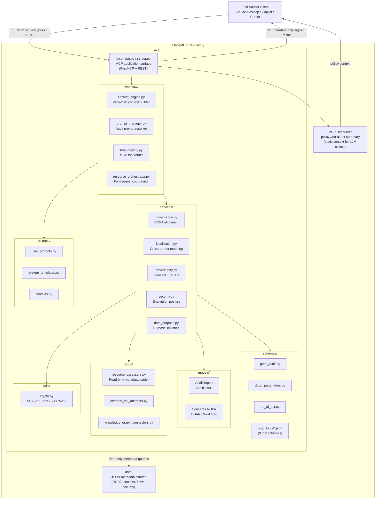

# EthosMCP: Architecture Reference

**Zero-Trust AI Governance & Compliance Auditing Framework**
**Author:** Nyayosh Bharucha, Principal AI Governance Architect
**Version:** 1.1.0 | **Status:** Active

---

> **Governing principle:** *Data is audited through schemas, lineage, control metadata, and cryptographic evidence — never through raw PII.*

---

## Table of Contents

1. [Architectural Intent](#1-architectural-intent)
2. [Repository Structure & MCP Composition](#2-repository-structure--mcp-composition)
3. [Enterprise Zero-Trust Data Flow](#3-enterprise-zero-trust-data-flow)
4. [Data-Centric Control Narrative](#4-data-centric-control-narrative)
5. [Component Breakdown & Legal Mapping](#5-component-breakdown--legal-mapping)
6. [Enterprise Interpretation](#6-enterprise-interpretation)

---

## 1. Architectural Intent

EthosMCP translates regulatory obligations (GDPR, DPDP Act, EU AI Act) into executable audit vectors exposed through the **Model Context Protocol (MCP)**. The framework enforces three structural guarantees at the architectural level — not by policy documentation, but by code:

| Guarantee | Mechanism |
| :--- | :--- |
| **Zero-Trust Audit Boundary** | MCP tools never access, store, or return raw personal data. Results are schema metadata, aggregated compliance vectors, and cryptographic state hashes only. |
| **Cryptographic Non-Repudiation** | Every audit report carries an HMAC-SHA256 response signature and a SHA-256 hash of the data state at query time. Neither the auditor nor auditee can alter a report without breaking the signature. |
| **Metadata-Only Posture** | All four audit phases operate in read-only mode. No tool invocation can mutate the state of an underlying source system. |

---

## 2. Repository Structure & MCP Composition

The diagram below maps the exact source structure to the MCP client integration surface. Data moves **top-to-bottom**: metadata enters from `data/` fixtures and internal services, passes through the audit and crypto layers, and exits to the MCP client as schema-level evidence only.

> **Note on "resources":** `resources` in this diagram refers to the MCP resource layer exposed by `src/mcp_app.py` (e.g., `policy://eu-ai-act-summary`), not a separate top-level folder.

---

## 3. Enterprise Zero-Trust Data Flow

This view represents EthosMCP as an enterprise compliance microservice layer. The critical control objective is enforced at every step: **only metadata and cryptographic evidence cross the audit boundary; raw PII remains isolated**.

```mermaid
flowchart LR
    auditor["🧑‍💼 AI Auditor Client\nRequest origin"]
    gateway["🔀 MCP API Gateway / Router\nFastMCP + server routing"]
    validation["🔐 Zero-Trust Validation Layer\nauthn · authz · policy gating\nread-only enforcement"]
    orchestrator["⚙️ Audit Orchestration Layer\ncontext + prompts + tool registry\nresource_orchestrator.py"]
    policy["📋 MCP Policy Resources\nEU AI Act / governance context\npolicy://eu-ai-act-summary"]

    subgraph toolsuite["Compliance Tool Execution Plane"]
        direction TB
        gdpr["📌 GDPR Governance Tool\naudit_ropa_alignment()\nget_ropa_records()"]
        flow["🗺️ Cross-Border Flow Tool\nanalyze_data_flow()"]
        consent["✅ Consent & DSAR Tool\nquery_consent_registry()\nsimulate_dsar_workflow()"]
        security["🔒 Security Controls Tool\naudit_encryption_coverage()"]
        purpose["🎯 Purpose Limitation Tool\nverify_data_purpose()"]
    end

    subgraph metadata["Metadata Evidence Sources\n(data/ fixtures · read-only)"]
        direction TB
        ropa["ropa_records.json\nProcessing activity records"]
        topo["data_flow_map.json\nNetwork topology metadata"]
        registry["consent_registry.json\nConsent state-machine evidence"]
        secmeta["security_config.json\nEncryption + breach posture"]
        purposemeta["Dataset Purpose Registry\nAllowed / prohibited purpose maps"]
    end

    crypto["🔑 Cryptographic Integrity Step\nSHA-256 query hash\nSHA-256 data-state hash\nHMAC-SHA256 response signature\n(src/utils/crypto.py)"]
    report["📄 AuditReport Envelope\nstatus · findings · evidence\nhashes · HMAC signature"]
    output["📤 Client Output\nschema + metadata + compliance findings\n⛔ never raw PII"]

    pii[("⚠️ Raw PII\nproduction records")]
    barrier["🚧 Isolation Boundary\nPII not returned through audit interface"]

    auditor -- "1 · MCP request" --> gateway
    gateway -- "2 · route" --> validation
    validation -- "3 · authenticated, authorized\nread-only request" --> orchestrator
    policy --> orchestrator

    orchestrator --> gdpr
    orchestrator --> flow
    orchestrator --> consent
    orchestrator --> security
    orchestrator --> purpose

    gdpr -- "metadata query" --> ropa
    flow -- "metadata query" --> topo
    consent -- "metadata query" --> registry
    security -- "metadata query" --> secmeta
    purpose -- "metadata query" --> purposemeta

    ropa --> crypto
    topo --> crypto
    registry --> crypto
    secmeta --> crypto
    purposemeta --> crypto

    pii -. "isolated from response path" .-> barrier
    barrier -. "blocks raw personal data" .-> output

    crypto --> report
    report --> output
    output -- "4 · signed metadata-only result" --> auditor
```

---

## 4. Data-Centric Control Narrative

### 4.1 What moves through EthosMCP

The audit interface handles only the following data classes:

- Schema definitions and Pydantic model structures
- Records of processing activity (ROPA) metadata
- Data flow topology maps with authorization and mechanism fields
- Consent-state metadata and withdrawal-friction scores
- Encryption posture, TLS coverage, and breach-detection status
- Dataset purpose registry lookups
- `AuditReport` objects containing `AuditResult` arrays
- SHA-256 query digests, SHA-256 data-state hashes, HMAC-SHA256 signatures

### 4.2 What does **not** move through EthosMCP

The framework is explicitly designed to prevent returning:

- Raw personal data or identifiable information
- Production business records or unfiltered database rows
- Identity records from operational systems
- Mutable commands that alter source systems

### 4.3 Why this matters

By keeping the audit layer metadata-only, EthosMCP ensures the audit process itself cannot become a new data-exposure channel. The auditor receives sufficient evidence to assess governance, cross-border transfer compliance, consent validity, DSAR latency, and technical security controls — without the framework becoming a privileged data extraction path.

---

## 5. Component Breakdown & Legal Mapping

| Technical Component | Source File(s) | Primary Responsibility | Data / Metadata Handled | Legal / Standards Mapping |
| :--- | :--- | :--- | :--- | :--- |
| **MCP Application Surface** | `src/mcp_app.py`, `src/server.py` | Exposes all audit tools via MCP protocol; accepts stdio and HTTP transport | MCP request envelopes, tool routing, transport metadata | **EU AI Act** governance transparency; **ISO/IEC 42001** operational traceability |
| **Zero-Trust Context Engine** | `src/workflow/context_engine.py` | Builds per-request, zero-trust execution context; enforces read-only posture | Request identity, scope metadata, policy state | **GDPR Art. 25** (privacy by design); **ISO/IEC 42001** control design |
| **Prompt & Context Orchestration** | `src/workflow/prompt_manager.py`, `src/prompts/` | Resolves system instructions, user audit prompts, and phase context definitions | Audit prompts, context definitions, tool routing metadata | **ISO/IEC 42001** documented operational procedures |
| **Tool Registry & Router** | `src/workflow/tool_registry.py` | Registers and routes MCP tool invocations to service handlers | Tool schemas, invocation payloads | Enables programmatic compliance control per **GDPR Art. 30** and **DPDP Act** traceability |
| **Resource Orchestrator** | `src/workflow/resource_orchestrator.py` | Coordinates context + prompts + tool execution for full-request lifecycle | Full execution context, orchestrated tool results | Operational sequencing aligned with **ISO/IEC 42001** audit management |
| **MCP Policy Resources** | `src/mcp_app.py` (`@mcp.resource`) | Delivers static governance policy context to LLM clients | EU AI Act compliance policy text | **EU AI Act Art. 13** (transparency); **ISO/IEC 42001** policy availability |
| **ROPA Alignment Service** | `src/services/governance.py` | Validates processing inventories, legal basis, and purpose descriptions | ROPA metadata, legal basis fields, purpose descriptors, data categories | **GDPR Art. 30**; **EU AI Act Art. 10** (high-risk training data governance) |
| **Data Localization Service** | `src/services/localization.py` | Evaluates cross-border transfers and legal transfer mechanisms | Source/destination regions, authorization flags, SCC/BCR/adequacy decision metadata | **GDPR Arts. 44–49**; **DPDP Act Sec. 16** (cross-border restrictions) |
| **Consent & DSAR Service** | `src/services/sovereignty.py` | Verifies consent validity, withdrawal friction, and DSAR erasure latency | Consent-state metadata, withdrawal-friction scores, DSAR SLA timing evidence | **GDPR Arts. 6, 7, 12, 15–17**; **DPDP Act Secs. 5, 6, 10–14** |
| **Security Controls Service** | `src/services/security.py` | Evaluates encryption coverage, TLS posture, breach-detection readiness, and DPA completeness | Encryption metadata, TLS status, breach-detection flags, Data Processing Agreement metadata | **GDPR Arts. 28, 32, 33**; **ISO/IEC 42001 Clause 9** (performance evaluation) |
| **Purpose Limitation Service** | `src/services/data_purpose.py` | Checks whether a declared dataset-use purpose is permitted under the dataset's registered policy | Dataset-purpose registry metadata, allowed and prohibited purpose mappings | **GDPR** purpose limitation principle (Art. 5(1)(b)); **EU AI Act Art. 10** |
| **Metadata Resource Accessors** | `src/tools/resource_accessors.py` | Read-only loader for JSON metadata fixtures from `data/` | ROPA, consent, flow, security configuration fixtures | Enforces read-only audit posture; supports **GDPR Art. 25** data minimization |
| **Regulatory Schema Definitions** | `src/schemas/gdpr_audit.py`, `src/schemas/dpdp_parameters.py`, `src/schemas/eu_ai_act.py` | Defines Pydantic validation models for all compliance check inputs and outputs | Schema type definitions, regulatory parameter structures | Provides machine-readable compliance vectors for **GDPR**, **DPDP Act**, and **EU AI Act** |
| **MCP Tool JSON Schemas** | `src/schemas/mcp_tools/*.json` | Declares input/output contracts for all 8 registered MCP tools | Tool parameter schemas, result schemas | Ensures structured, verifiable tool invocation per MCP specification |
| **Cryptographic Integrity Layer** | `src/utils/crypto.py` | Generates SHA-256 query digests, SHA-256 data-state hashes, HMAC-SHA256 response signatures | Hash inputs (query params, data state), HMAC signing payloads | **GDPR Art. 5(2)** accountability principle; non-repudiation for **ISO/IEC 42001** auditability |
| **AuditReport / AuditResult Models** | `src/models/audit.py` | Defines the structured output envelope for all audit phases | Status fields, check arrays, execution timestamps, hash and signature fields | Provides legally defensible, structured evidence for regulatory submission |
| **GDPR / DPDP / EU AI Act Regulatory Modules** | `src/regulatory/` | Implements regulatory logic for the DPDP Act and ISO/IEC 42001 | Regulatory rule sets, compliance determination logic | **DPDP Act**; **ISO/IEC 42001** |

---

## 6. Enterprise Interpretation

From an enterprise architecture standpoint, EthosMCP functions as:

| What it is | What it is not |
| :--- | :--- |
| A **compliance control plane** | A business transaction platform |
| A **metadata audit boundary** | A raw-data analytics pipeline |
| A **zero-trust evidence service** | A general-purpose integration bus |
| A **legal-to-technical translation layer** | Merely a documentation artifact |
| A **cryptographically verifiable audit log** | A mutable reporting dashboard |

Its value lies in making regulatory requirements computationally testable while enforcing strict isolation between the audit workflow and the underlying personal data estate.

---

## 7. Further Reading

| Document | Description |
| :--- | :--- |
| [README.md](./README.md) | Executive summary, quick-start, and AI client integration guide |
| [AUDITING_FRAMEWORK.md](./AUDITING_FRAMEWORK.md) | Four-phase deterministic audit methodology and DSAR simulation protocol |
| [GOVERNANCE.md](./GOVERNANCE.md) | Strategic mandate and ISO/IEC 42001 alignment |
| [docs/compliance_mapping.md](./docs/compliance_mapping.md) | Statutory provision-to-audit-vector mapping table |
| [docs/deployment.md](./docs/deployment.md) | Docker, environment configuration, and CLI reference |

---

*EthosMCP demonstrates a defensible architectural model for AI governance in which data movement is visible, data purpose is testable, audit evidence is cryptographically verifiable, and raw PII remains isolated from the audit interface by design.*
