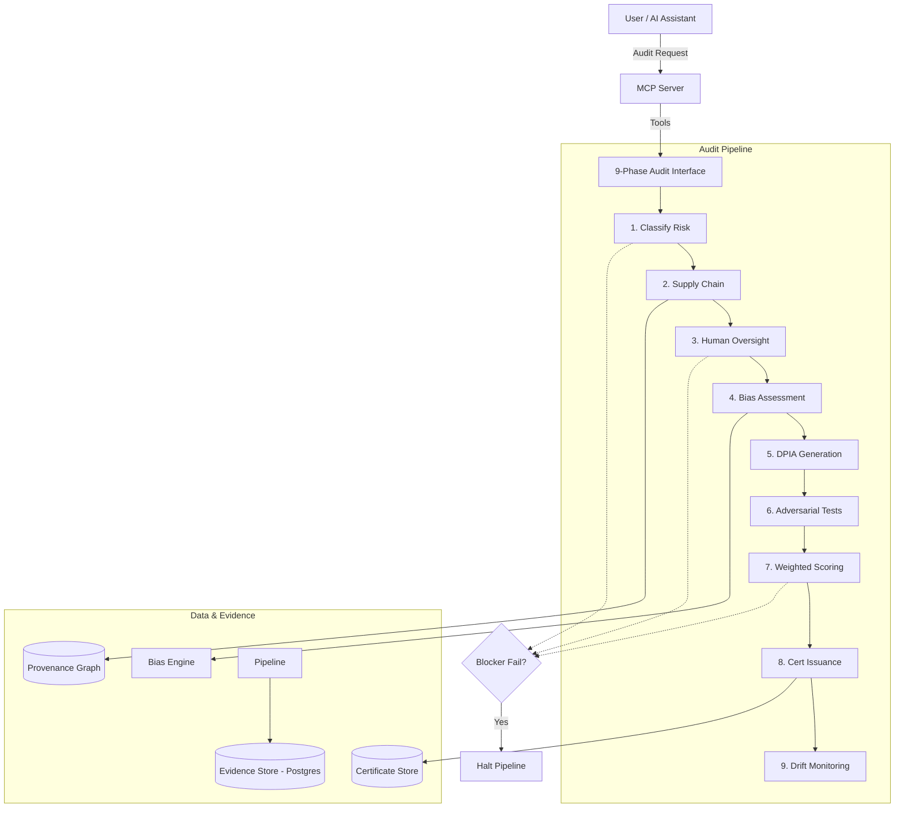

# AI Governance MCP Server

A 9-phase, regulation-aware AI audit engine built on the Model Context Protocol. Produces cryptographically signed W3C Verifiable Credentials as audit certificates.

## 📌 Executive Summary

Modern AI systems require rigorous, automated oversight to ensure compliance with emerging global regulations. The **AI Governance MCP Server** operationalizes complex legal requirements into a deterministic 9-phase audit pipeline.

### 💡 Key Features
*   **9-Phase Audit Pipeline:** Sequential verification from risk classification to post-deployment monitoring.
*   **Regulation-Aware:** Built-in mappings for EU AI Act, GDPR, NIST AI RMF, and ISO 42001.
*   **Explainability Mandate:** Every audit finding includes a plain-language explanation and direct regulatory citations.
*   **Verifiable Evidence:** Produces W3C Verifiable Credentials (VC 2.0) as immutable audit certificates.
*   **On-Premise Native:** Designed for zero-data-egress environments to protect sensitive enterprise IP.

## 🏛️ Architectural Overview

The system consists of a TypeScript MCP server acting as the interface layer, communicating with a Python FastAPI backend that orchestrates specialized microservices for bias detection, adversarial testing, and drift monitoring.



## 🚀 Quick Start

### Prerequisites
*   Docker & Docker Compose
*   Node.js 20+
*   Python 3.11+

### Deployment
1.  Clone the repository.
2.  Copy `.env.example` to `.env` and configure secrets.
3.  Run the full stack:
    ```bash
    docker-compose up --build
    ```

## 📖 Documentation
*   [Architecture Deep Dive](docs/ARCHITECTURE.md)
*   [Regulatory Mapping](docs/REGULATORY_MAPPING.md)
*   [Phase-by-Phase Guide](docs/PHASE_GUIDE.md)
*   [Deployment Guide](docs/DEPLOYMENT.md)

## 🤝 License
This project is licensed under the MIT License - see the [LICENSE](LICENSE) file for details.
